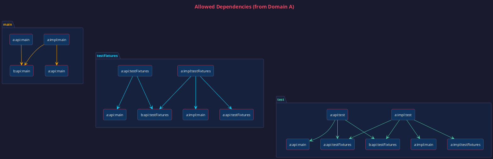

# ADR-016: Module Dependency Strategy

**Status**: Accepted

**Date**: 2024-12-13

**Updated**: 2025-01-16

---

## Decision

We enforce a strict module dependency strategy to prevent architectural erosion. Dependencies are validated at build
time by the `validateModuleDependencies` Gradle task.

---

## Module Types

### Domain Modules

Each bounded context has three module types:

| Module       | Purpose                                                  | Visibility                |
|--------------|----------------------------------------------------------|---------------------------|
| `-api`       | Public contract: interfaces, DTOs, errors, events        | Exposed to other domains  |
| `-impl`      | Private implementation: domain, services, infrastructure | Hidden from other domains |
| `-worldview` | Seeding data: canonical examples for dev/demos           | Exposed to application    |

### Infrastructure Modules

| Module        | Purpose                                   | Dependencies                         |
|---------------|-------------------------------------------|--------------------------------------|
| `application` | Wires everything into deployable artifact | All `-impl` and `-worldview` modules |
| `common-*`    | Shared utilities (money, result, time)    | No domain dependencies               |

---

## Source Sets

Each module may have multiple source sets:

| Source Set     | Purpose                        | Location                  |
|----------------|--------------------------------|---------------------------|
| `main`         | Production code                | `src/main/kotlin`         |
| `test`         | Test code (not shared)         | `src/test/kotlin`         |
| `testFixtures` | Shared test helpers (builders) | `src/testFixtures/kotlin` |

**testFixtures location:**

- **`-api` modules**: Primary location. Builders for DTOs shared across all consumers.
- **`-impl` modules**: Allowed but rare. Internal test helpers not shared outside the module.

---

## Dependency Rules

Rules are marked as **[enforced]** (blocked by validation) or **[guideline]** (convention only).

### Production Dependencies (main → main)

| From      | To                  | Allowed? | Enforced? | Rationale                     |
|-----------|---------------------|:--------:|:---------:|-------------------------------|
| api       | api (other domain)  |    ✓     | whitelist | Cross-domain contracts        |
| impl      | api (own)           |    ✓     |     -     | Implements own contract       |
| impl      | api (other domain)  |    ✓     | whitelist | Uses other contracts          |
| worldview | api (any)           |    ✓     | whitelist | Builds from DTOs              |
| worldview | worldview (other)   |    ✓     | whitelist | Cross-domain seeding          |
| api       | impl                |    ✗     |  **yes**  | Breaks encapsulation          |
| api       | worldview           |    ✗     |  **yes**  | API must be stable            |
| impl      | impl (other domain) |    ✗     |  **yes**  | Creates coupling              |
| impl      | worldview           |    ✗     |  **yes**  | Impl shouldn't need seeds     |
| worldview | impl                |    ✗     |  **yes**  | Worldview sees only contracts |

### Test Dependencies

| From | To                     | Allowed? | Enforced? | Rationale                |
|------|------------------------|:--------:|:---------:|--------------------------|
| test | testFixtures (any api) |    ✓     | whitelist | Shared test builders     |
| test | main (allowed deps)    |    ✓     |     -     | Inherits main rules      |
| test | impl (other domain)    |    ✗     |  **yes**  | Same as main             |
| test | worldview              |    ✗     | guideline | Use testFixtures instead |

### testFixtures Dependencies

| From         | To                       | Allowed? | Rationale                  |
|--------------|--------------------------|:--------:|----------------------------|
| testFixtures | main (own module)        |    ✓     | Builds DTOs from own types |
| testFixtures | testFixtures (other api) |    ✓     | Compose builders           |

---

## The Application Module

The `application` module is the composition root—it wires all domain modules into a deployable Spring Boot application.

### What It Contains

```
application/
├── src/main/kotlin/
│   └── config/           # FlywayConfig, SecurityConfig, OpenApiConfig
│   └── EcologiqueApplication.kt
├── src/test/kotlin/
│   └── cucumber/         # Application-level integration tests
└── build.gradle.kts
```

### Special Dependency Rules

The application module is a **composition root** with relaxed inbound rules (it can depend on `-impl` modules) but strict outbound rules (no module can depend on it):

```kotlin
// root build.gradle.kts
moduleDependencyValidation {
    compositionRoots.set(setOf(":application"))
}
```

### Allowed Dependencies

```kotlin
// application/build.gradle.kts
dependencies {
    // All impl modules (to wire Spring beans)
    implementation(project(":products:products-impl"))
    implementation(project(":users:users-impl"))
    implementation(project(":orders:orders-impl"))

    // All worldview modules (for runtime seeding)
    implementation(project(":products:products-worldview"))
    implementation(project(":users:users-worldview"))
    implementation(project(":orders:orders-worldview"))

    // Test fixtures from api modules (for integration tests)
    testImplementation(testFixtures(project(":products:products-api")))
    testImplementation(testFixtures(project(":orders:orders-api")))
}
```

### What It Should NOT Contain

- **Domain logic** — belongs in `-impl` modules
- **DTOs or interfaces** — belongs in `-api` modules
- **Test fixtures** — belongs in `-api` modules

The application module is purely for composition and configuration.

### No Module May Depend on Composition Roots

Composition roots like `application` are leaf nodes in the dependency graph. Domain modules must never depend on them:

```
✗ products-impl → application    (would create circular dependency)
✗ orders-api → application       (api cannot depend on composition root)
```

This is enforced by the `compositionRoots` configuration in validation.

---

## Common Modules

The `common-*` modules provide shared utilities that any module can depend on:

| Module           | Purpose                                |
|------------------|----------------------------------------|
| `common-result`  | `Result<T, E>` type for error handling |
| `common-money`   | `Money` and `Currency` value objects   |
| `common-country` | Country codes                          |
| `common-time`    | Time utilities                         |

### Rules for Common Modules

- **No domain dependencies**: Common modules cannot depend on any domain module
- **Dependency direction**: Domain modules depend on common, never the reverse
- **Pure utilities**: No Spring dependencies, no business logic

```
common-result/          # Can be used by any module
    └── depends on: nothing

products-api/
    └── depends on: common-result, common-money

products-impl/
    └── depends on: products-api, common-result, common-money
```

---

## Cross-Domain Whitelist

By default, domains cannot depend on each other. Dependencies must be explicitly allowed:

```kotlin
// root build.gradle.kts
moduleDependencyValidation {
    allowedDependencies.set(
        mapOf(
            "products" to emptySet(),
            "users" to emptySet(),
            "orders" to setOf("products", "users"),
        )
    )
}
```

This means:

- `orders` can depend on `products` and `users`
- `products` and `users` are independent
- Any unlisted dependency is forbidden

---

## Quick Reference: What Can Depend on What?

For domains A and B where A is whitelisted to depend on B:

```
A-api
  ├── main ────────► B-api main              ✓
  ├── test ────────► B-api testFixtures      ✓
  └── testFixtures ► B-api testFixtures      ✓

A-impl
  ├── main ────────► B-api main              ✓
  ├── main ────────► B-impl main             ✗ (use B-api)
  └── test ────────► B-api testFixtures      ✓

A-worldview
  ├── main ────────► B-api main              ✓
  ├── main ────────► B-worldview main        ✓
  └── main ────────► B-impl main             ✗ (worldview sees only contracts)

application (excluded from validation)
  ├── main ────────► all impl modules        ✓
  ├── main ────────► all worldview modules   ✓
  └── test ────────► api testFixtures        ✓
```

### Visual Dependency Matrix

The following diagram shows all allowed dependencies from domain A to domain B (where A is whitelisted to depend on B),
grouped by source set:



**Reading the diagram:**

- **main** (orange): Production code dependencies. impl depends on own api and other domain apis; api can depend on
  other domain apis.
- **testFixtures** (cyan): Test helper dependencies. Can depend on own main code plus other domain testFixtures.
- **test** (green): Test code dependencies. Can depend on own main, own testFixtures, and other domain testFixtures.

---

## Why Three Modules?

```
products/
├── products-api/           # Contract + testFixtures (via plugin)
├── products-impl/          # Implementation
└── products-worldview/     # Seeding data
```

**Benefits:**

- **api** is the stable contract, testFixtures live with it
- **impl** is fully hidden, uses Kotlin `internal`
- **worldview** can only see contracts, can depend on other worldviews
- Worldview is a separate module so it cannot access impl internals
- Clean separation without excessive module count

---

## Rationale for Key Rules

### "impl cannot depend on other impl"

Forces all cross-domain communication through stable APIs. If orders-impl could depend on products-impl, changes to
products internals would break orders.

### "worldview can depend on other worldview"

Seeding realistic data often requires cross-domain objects. An order needs a user and products. Worldview-to-worldview
is safe because worldviews only contain data, no logic.

### "testFixtures primarily in api modules"

Test fixtures build DTOs from the public contract. Putting them in api means:

- They can't access impl internals
- Any module depending on the api can use them
- Single source of truth for test data builders

Impl modules may have their own testFixtures for internal test helpers, but these shouldn't be shared.

### "test should not depend on worldview" (guideline)

Worldview is for runtime seeding, not tests. Tests should use testFixtures (explicit builders) so test data is visible
in the test file. This is a convention, not enforced by validation.

---

## Enforcement

The `validateModuleDependencies` task runs as part of `check`:

```bash
./gradlew validateModuleDependencies
```

Violations produce a report at `build/reports/module-validation/report.md`.

### What Validation Catches

| Rule                           |   Enforced    |
|--------------------------------|:-------------:|
| api → impl/worldview           |       ✓       |
| impl → impl (cross-domain)     |       ✓       |
| impl → worldview               |       ✓       |
| worldview → impl               |       ✓       |
| any → application              |       ✓       |
| Cross-domain without whitelist |       ✓       |
| test → worldview               | ✗ (guideline) |

Guidelines rely on code review and team discipline.

---

## Consequences

### Positive

- Spaghetti dependencies caught at build time
- Clear mental model for developers
- Modules can evolve independently
- Compile-time enforcement, not just documentation

### Negative

- Initial learning curve
- Must update whitelist for new cross-domain dependencies
- Three modules per domain adds some overhead
